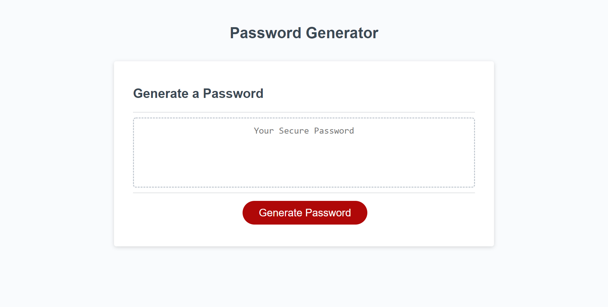
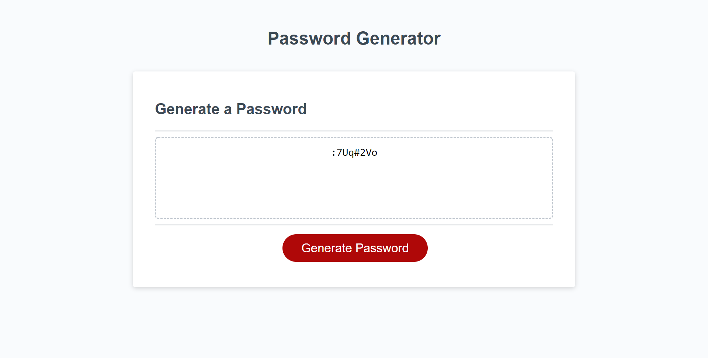

# Homework03 Random Password Generator

Link to site: [https://ctrahan94.github.io/homework03_random_password_generator/](https://ctrahan94.github.io/homework03_random_password_generator/)

link to repo: [https://github.com/ctrahan94/homework03_random_password_generator](https://github.com/ctrahan94/homework03_random_password_generator) 

## The Objective

To create an application that an employee can use to generate a random password based on criteria they’ve selected (special, numeric, uppercase or lowercase characters).

## The Motive
To randomly generate a strong password that meets certain criteria to provide the user with greater security.

## The Solution
Used javascript to create a series of prompts, confirms, alerts, functions and loops that prompt the user to enter the desired length of the password. Their password must be a minimum of 8 characters and cannot have more than 128 characters. Based on what criteria the user selects a random password will be generated. 

### What the deployed site looks like
Main Page

How long do you want your password to be?

Do you want special characters?

Do you want numbers?

Do you want uppercase letters?

Do you want lowercase letters?

Generated Password

Does not meet criteria page

